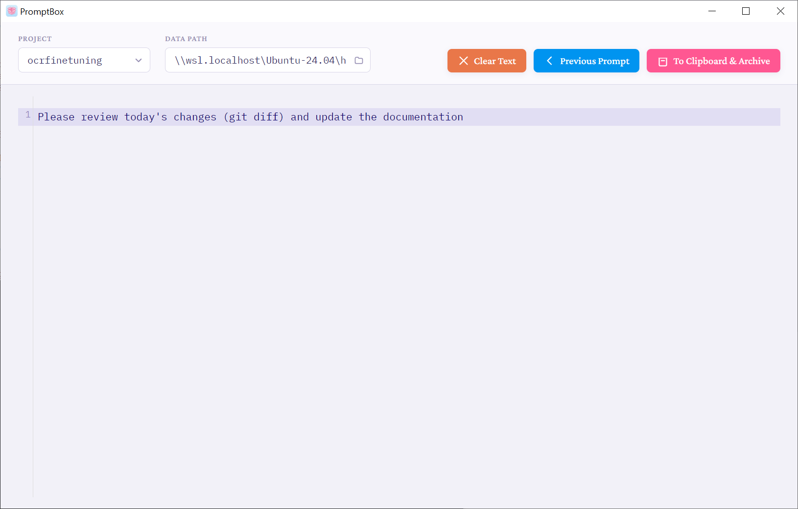

# PromptBox

A desktop prompt editor and archive tool for AI/LLM workflows.

PromptBox gives you a dedicated, distraction-free editor to write and refine prompts for AI tools like ChatGPT, Claude, or any other language model. When a prompt is ready, one click saves it to a local archive organized by project — and copies it to your clipboard at the same time.

All data is stored as plain JSON files on your own machine. No account, no cloud, no telemetry.



---

## Features

- **Rich code editor** — powered by CodeMirror 6 with Markdown syntax highlighting and the Noctis Lilac theme
- **Project-based organization** — group your prompts into named projects
- **One-click archive** — saves the prompt and copies it to clipboard simultaneously
- **History navigation** — browse previously archived prompts and reload them
- **Local-first storage** — data lives in a folder of your choice as human-readable JSON
- **Keyboard shortcuts** — zoom in/out, undo/redo
- **Cross-platform** — Windows, Linux, and macOS

---

## Download

Pre-built installers are available on the [Releases](../../releases) page:

| Platform | Format |
|---|---|
| Windows | `.exe` installer or portable `.exe` |
| Linux | `.AppImage` or `.deb` |
| macOS | build from source (see below) |

---

## Running from source

### Prerequisites

- [Node.js](https://nodejs.org/) v18 or later (includes npm)
- Git

### Steps

```bash
# 1. Clone the repository
git clone https://github.com/elmtree-software/promptbox.git
cd promptbox

# 2. Install dependencies
npm install

# 3. Start the app in development mode
npm run dev
```

The app window will open. Changes to source files are reflected on reload.

---

## Building a distributable package

```bash
# Build for the current platform
npm run build

# Build specifically for Windows
npm run build:win

# Build specifically for Linux
npm run build:linux
```

Output packages are placed in the `release/` directory.

---

## How to use PromptBox

### The interface at a glance

```
┌────────────────────────────────────────────────────────────────────┐
│  Project ▼  │  Data Path 📁  │  Clear  │  ◀ Previous  │  Archive  │
├────────────────────────────────────────────────────────────────────┤
│                                                                    │
│   Editor area — write your prompt here                             │
│                                                                    │
└────────────────────────────────────────────────────────────────────┘
```

The toolbar at the top contains all controls. The large area below is the editor.

---

### Step 1 — Set a data path

The **Data Path** field shows where PromptBox stores your archive files. By default it is:

- `~/promptbox_data` on Linux and macOS
- `C:\Users\YourName\promptbox_data` on Windows

The folder is created automatically the first time you archive a prompt.

To change it, click the **folder icon** next to the path field and pick a different directory. You can also type a path directly.

---

### Step 2 — Choose or create a project

Every archived prompt belongs to a **project**. A project is just a name that groups related prompts together. Each project is stored as a single JSON file (e.g. `my-project.json`).

**To select an existing project:**
1. Click the dropdown arrow next to the **Project** field
2. A list of existing projects in your data folder appears
3. Click a project name to select it

**To create a new project:**
Simply type a new name directly into the **Project** field. The file will be created automatically when you first archive a prompt.

**To sort the project list:**
When the dropdown is open, a **Sort** button appears in the top-right corner of the list. Toggle between:
- **Recent** — most recently modified first (default)
- **A–Z** — alphabetical order

---

### Step 3 — Write your prompt

Click anywhere in the editor area and start typing. The editor supports:

- Standard text editing (`Ctrl+Z` to undo, `Ctrl+Y` to redo)
- Markdown syntax highlighting
- Line numbers
- Line wrapping

There is no auto-save — the editor is a scratchpad until you archive.

---

### Step 4 — Archive

When your prompt is ready, click **To Clipboard & Archive** (the pink button on the right).

This does three things at once:
1. Saves the prompt to your project's JSON file with a timestamp
2. Copies the prompt text to your clipboard
3. Clears the editor so you can start fresh

A confirmation message appears at the bottom of the screen. **Click the message** to open the archive file in your system's file explorer.

---

### Browsing your history

To revisit a previously archived prompt:

1. Select the project from the dropdown
2. Click **Previous Prompt** (the blue button)

This loads the most recently archived prompt. The button then splits into two:

- **< Previous** — go further back in history
- **Next >** — move forward again

The status message shows which prompt you are viewing (e.g. *Loaded prompt 3 of 7*).

To exit history mode, simply edit the text in the editor — the history index resets automatically.

---

### Clearing the editor

Click **Clear Text** (the orange button) to wipe the editor without archiving. This action is **undoable** with `Ctrl+Z`.

---

## Keyboard shortcuts

| Shortcut | Action |
|---|---|
| `Ctrl+Z` / `Cmd+Z` | Undo |
| `Ctrl+Y` / `Cmd+Y` | Redo |
| `Ctrl++` / `Cmd++` | Zoom in |
| `Ctrl+-` / `Cmd+-` | Zoom out |
| `Ctrl+0` / `Cmd+0` | Reset zoom |

---

## Data format

Prompts are stored as JSON arrays. Each entry looks like this:

```json
[
  {
    "prompt": "Explain the concept of recursion using a real-world analogy.",
    "timestamp": "2026-01-09T08:24:16.589Z",
    "hostname": "my-laptop"
  },
  {
    "prompt": "Rewrite the following text in a formal academic tone: ...",
    "timestamp": "2026-01-10T14:05:03.112Z",
    "hostname": "my-laptop"
  }
]
```

The files are plain text and can be opened, edited, or backed up with any tool. If a file is corrupted, PromptBox automatically backs it up before creating a fresh one.

---

## Project structure

```
promptbox/
├── electron/
│   ├── main.js        # Electron main process, IPC handlers, file I/O
│   └── preload.js     # Secure IPC bridge between main and renderer
├── src/
│   ├── main.js        # Frontend application logic
│   └── style.css      # UI styles (Noctis Lilac theme)
├── public/
│   └── icon.*         # Application icons
├── index.html         # HTML entry point
├── vite.config.js     # Build configuration
└── package.json
```

---

## Contributing

Contributions are welcome. Please open an issue first to discuss the change you have in mind.

1. Fork the repository
2. Create a branch: `git checkout -b feature/your-feature`
3. Make your changes
4. Open a pull request

---

## License

[Apache License 2.0](LICENSE)
